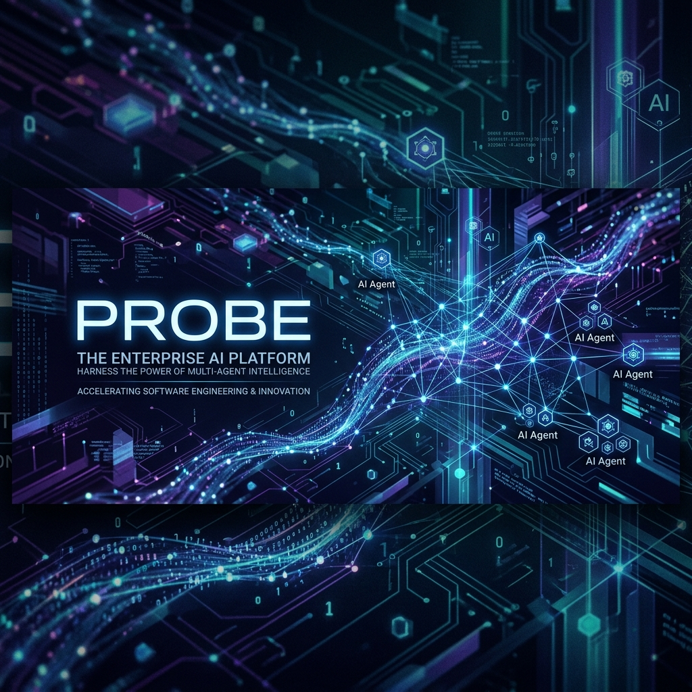
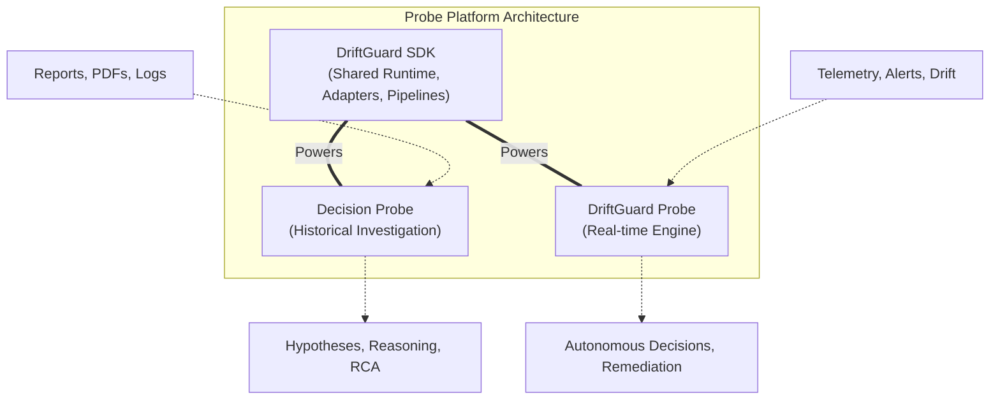
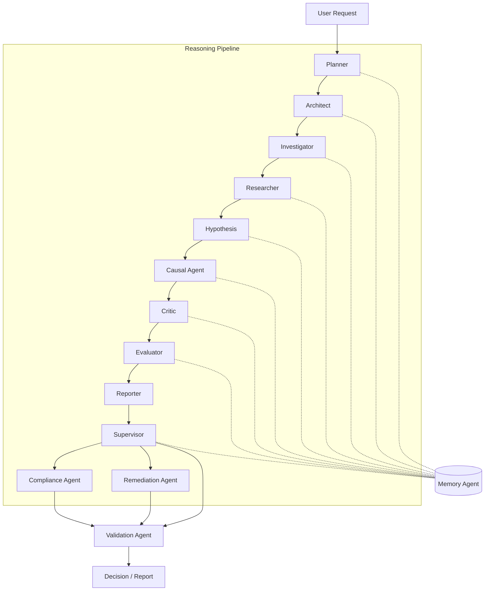
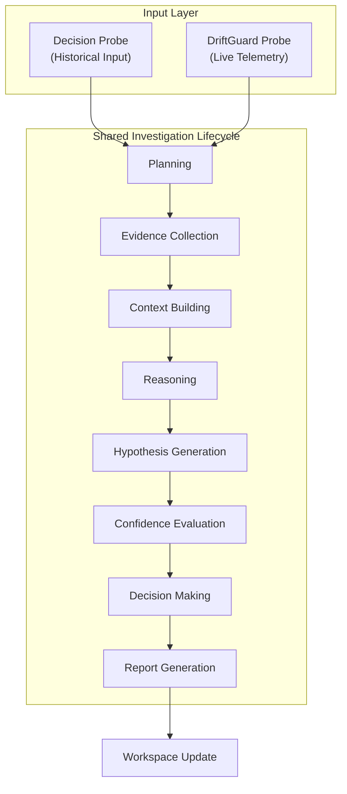
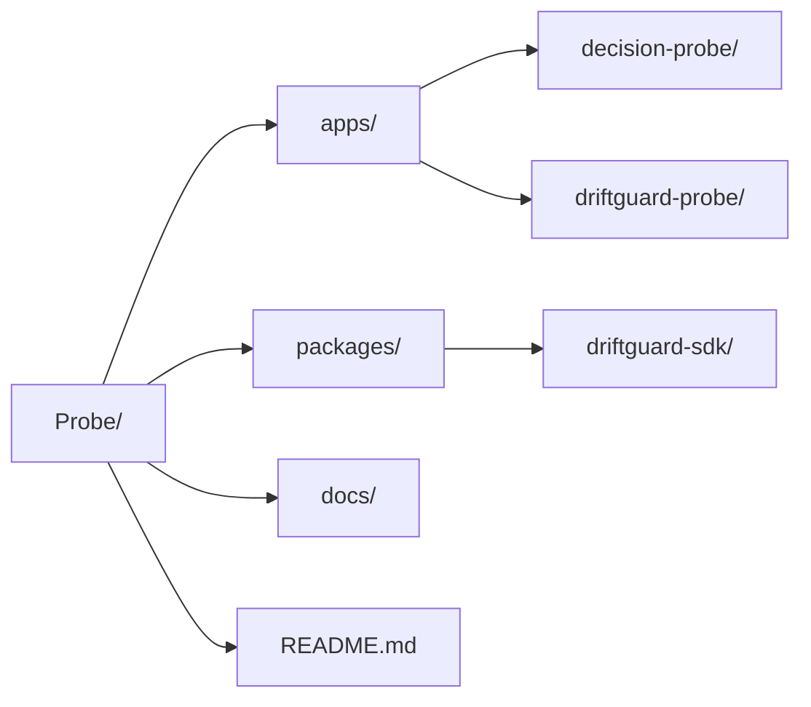

<!-- Banner Placeholder -->
<div align="center">
  
</div>

# Probe

> **AI-native Multi-Agent Investigation Platform**

<!-- Badges Placeholder -->
<p align="center">
  <a href="#"></a>
  <a href="#"></a>
  <a href="#"></a>
  <a href="#"></a>
</p>

Probe is a unified, AI-native multi-agent investigation platform designed to automate and augment complex reasoning tasks across historical and live operational environments. By leveraging specialized AI agents, structured evidence collection, and rigorous causal analysis, Probe transforms raw data, telemetry, and documents into actionable decisions, root cause analyses, and comprehensive investigation reports.

---

## What is Probe?

Probe is an enterprise-grade platform capable of investigating both historical and live operational incidents. It provides a robust, extensible framework where multiple autonomous agents collaborate to analyze reports, logs, and real-time metrics. Probe serves as the intelligence layer for operational resilience, bridging the gap between raw diagnostic data and actionable decision intelligence.

---

## Architecture

Probe is structured as a monorepo containing distinct applications and a shared software development kit.



* **`apps/decision-probe`**: AI-powered incident investigation application focused on historical data, documents, and post-mortem analysis.
* **`apps/driftguard-probe`**: Real-time AI investigation and decision engine designed for live telemetry, model drift, and operational alerts.
* **`packages/driftguard-sdk`**: The foundational shared framework providing core abstractions, agents, and infrastructure used by both applications.

---

## Core AI Agents

Probe utilizes a specialized, multi-agent architecture where distinct agents collaborate to resolve complex investigations.



* **Planner Agent**: Deconstructs high-level objectives into sequential, actionable investigation steps.
* **Architect Agent**: Analyzes structural dependencies and system topologies to provide architectural context.
* **Investigator Agent**: Navigates environments and queries systems to gather required data.
* **Researcher Agent**: Performs deep contextual retrieval across documents, wikis, and historical incident records.
* **Hypothesis Agent**: Synthesizes available evidence to formulate potential root causes and contributing factors.
* **Causal Agent**: Validates hypotheses against the evidence timeline to establish definitive cause-and-effect relationships.
* **Critic Agent**: Challenges proposed hypotheses and reasoning chains to eliminate bias and logical fallacies.
* **Evaluator Agent**: Quantifies the confidence level of conclusions based on evidence quality and reasoning validity.
* **Reporter Agent**: Compiles findings, timelines, and remediation steps into structured, human-readable reports.
* **Supervisor Agent**: Orchestrates the agent collective, managing state, routing tasks, and ensuring adherence to the plan.
* **Memory Agent**: Maintains short-term context and long-term investigation history for stateful reasoning.
* **Remediation Agent**: Formulates and executes automated corrective actions on live infrastructure.
* **Compliance Agent**: Ensures proposed actions and investigations adhere to organizational policies and regulatory standards.
* **Validation Agent**: Performs final integrity and safety checks before producing decisions or outputs.

---

## Investigation Workflow

The platform follows a deterministic, evidence-based investigation lifecycle.



---

## Applications

### Decision Probe
**Purpose**: An AI-powered platform for investigating historical incidents, post-mortems, and complex support escalations.
* **Features**: Ingestion of PDFs, logs, and unstructured documents; automated timeline reconstruction; structured evidence extraction.
* **Architecture**: Built on a batch-processing, document-heavy retrieval augmented generation (RAG) architecture with human-in-the-loop review gates.
* **Use cases**: Root cause analysis for resolved outages, security incident forensics, compliance auditing, and support ticket resolution.

### DriftGuard Probe
**Purpose**: A real-time investigation and decision engine operating directly on live operational and machine learning systems.
* **Real-time capabilities**: Sub-second telemetry processing and asynchronous event-driven agent triggers.
* **Streaming reasoning**: Continuously updates confidence scores and hypotheses as new data arrives from monitoring systems.
* **Integration with DriftGuard**: Natively connects with DriftGuard infrastructure to analyze model degradation, feature drift, and anomalous predictions.
* **Use cases**: Automated incident response, autonomous model retraining triggers, live system remediation, and real-time anomaly investigation.

---

## Shared SDK

The `driftguard-sdk` package provides the reusable infrastructure required to build agentic applications.

* **Adapters**: Standardized interfaces for integrating with external systems, databases, and APIs.
* **Monitoring**: Built-in observability tracing agent reasoning steps, token usage, and execution latency.
* **Validation**: Strict input/output schema enforcement for inter-agent communication.
* **Serving**: Production-ready deployment harnesses for exposing agent workflows via REST and gRPC.
* **Pipelines**: Declarative definitions for common investigation patterns and agent sequences.
* **Plugins**: Extensible module system allowing custom tools and capabilities to be injected into the agent environment.
* **Governance**: Policy enforcement engines to ensure agents operate within defined security and operational boundaries.
* **Extensibility**: Interface-first design allowing developers to easily swap foundational models, vector stores, and memory backends.

---

## Features

| Feature | Description | Decision Probe | DriftGuard Probe |
|---|---|:---:|:---:|
| **Multi-Agent Orchestration** | Supervisor-led collaboration of specialized AI agents. | ✓ | ✓ |
| **Real-time Telemetry Ingestion** | Processing of live metrics and streaming logs. | | ✓ |
| **Document Parsing (PDF, Text)** | Ingestion and OCR of unstructured historical reports. | ✓ | |
| **Causal Reasoning Engine** | Algorithmic validation of hypothesis against timelines. | ✓ | ✓ |
| **Automated Remediation** | Execution of corrective actions on live infrastructure. | | ✓ |
| **Confidence Scoring** | Quantitative evaluation of investigation conclusions. | ✓ | ✓ |

---

## Repository Structure



---

## Technology Stack

* **Backend**: Python, FastAPI, gRPC
* **Frontend**: React, TypeScript
* **AI**: LangChain, LlamaIndex, OpenAI/Anthropic APIs, Local LLM support
* **Infrastructure**: Docker, Kubernetes, Terraform
* **Observability**: OpenTelemetry, Prometheus, Grafana
* **Databases**: PostgreSQL, Qdrant/Pinecone (Vector), Redis (State)
* **Deployment**: GitHub Actions, ArgoCD

---

## Getting Started

### Installation

Clone the repository and install the shared SDK dependencies.

```bash
git clone https://github.com/organization/probe.git
cd probe

# Install shared SDK
cd packages/driftguard-sdk
pip install -e .
```

### Development

Set up your environment variables (e.g., API keys, database URIs) in a `.env` file at the root of the respective application directories.

### Running applications

To run Decision Probe:
```bash
cd apps/decision-probe
uvicorn src.main:app --reload --port 8000
```

To run DriftGuard Probe:
```bash
cd apps/driftguard-probe
uvicorn src.main:app --reload --port 8001
```

---

## Roadmap

* **Current**: Foundation multi-agent orchestration, core DriftGuard SDK release, baseline integrations.
* **Upcoming**: Enhanced streaming reasoning capabilities, deeper Kubernetes native integration, advanced causal analysis tools.
* **Future Vision**: Fully autonomous self-healing infrastructure managed by specialized agent collectives operating with verifiable confidence thresholds.

---

## Why Probe?

Probe differentiates itself from standard LLM wrappers and basic AI assistants by focusing on structured, verifiable investigations.

* **AI agents**: Employs specialized, role-based agents rather than a single monolithic prompt, allowing for distributed reasoning.
* **Structured investigations**: Follows rigorous, auditable workflows that mirror professional incident response methodologies.
* **Reasoning**: Prioritizes logical deduction, causal analysis, and critical evaluation over simple semantic search or text generation.
* **Evidence**: Grounds all conclusions in verifiable artifacts, logs, and telemetry, actively minimizing hallucination.
* **Decision intelligence**: Produces actionable, high-confidence decisions and remediation steps, transforming AI from a conversational interface into a robust operational engine.

---

## Contributing

We welcome contributions from the engineering community. Please review our `CONTRIBUTING.md` guidelines for information on code standards, pull request processes, and architectural conventions.

---

## License

Licensed under the Apache License, Version 2.0. See `LICENSE` for details.
