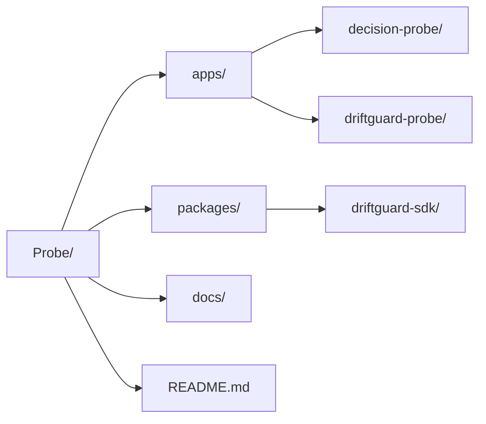

# Repository Architecture

The Probe project is structured as a monorepo containing multiple independent applications and shared SDK packages.

## Package Boundaries

### `apps/decision-probe`
- **Frontend**: A Next.js 15+ React application using Tailwind CSS, Shadcn UI, and Zustand for state management.
- **Backend**: A FastAPI server handling investigation APIs, SQLite/PostgreSQL persistence using SQLModel, and RAG pipelines.
- **Responsibility**: Batch ingestion of historical data (PDFs, docs) and orchestration of timeline-based root cause analysis.

### `apps/driftguard-probe`
- **Probe Engine**: The real-time reasoning engine containing the core agent implementations (`planner`, `supervisor`, `causal`, etc.).
- **Workflows**: Contains pre-defined orchestrated workflows (`investigation.py`, `retraining.py`, `compliance.py`).
- **Responsibility**: Real-time telemetry processing, autonomous remediation decisions, and streaming anomaly detection.

### `packages/driftguard-sdk`
- **Core Runtime**: Provides the foundational FastAPI setup, Prometheus metrics integration, and standard database models (`DBUser`, `DBProject`, `DBModel`).
- **Responsibility**: Exposes reusable modules for authentication, ML model metadata tracking, audit logging, and webhooks that both applications consume to maintain consistency.

## Shared Components
- **Persistence Layer**: Defined in the SDK, meaning `driftguard-probe` and `decision-probe` (where applicable) can operate on unified data models for users and registered models.
- **Observability**: Prometheus metrics (counters, gauges, histograms) are heavily standardized in the SDK for tracing agent reasoning steps and execution latency.
- **Webhooks**: The SDK provides a unified webhook mechanism to connect the platform back into external orchestrators (like Airflow).

## Module Dependencies
`decision-probe` and `driftguard-probe` independently import from `packages/driftguard-sdk`. The applications themselves are strictly decoupled and do not import from one another directly, allowing them to scale and be deployed independently.
