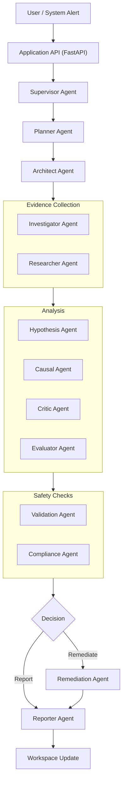

# Platform Runtime Flow

The Probe platform executes via a highly structured, orchestrated runtime loop. This document outlines the end-to-end execution path for a live investigation.

## Execution Path

## Detailed Flow
1. **Application Trigger**: An event (e.g., metric drift detected via `driftguard-sdk` webhooks) hits the Probe API.
2. **Supervisor Invocation**: The API initializes the Supervisor Agent with the alert context.
3. **Planning Phase**: The Planner deconstructs the alert. The Architect provides structural context.
4. **Execution Phase**: The Investigator queries live metrics (via tools), while the Researcher queries historical text/runbooks.
5. **Reasoning Phase**: Evidence is fed to the Hypothesis agent. The Causal agent algorithmically tests hypotheses against the evidence timeline. The Critic attempts to debunk the findings, and the Evaluator scores final confidence.
6. **Safety Gate**: Before any action is taken, the Validation and Compliance agents ensure the proposed remediation is safe and legal.
7. **Decision**: The Remediation agent executes the action (e.g., dispatching a retraining pipeline tool).
8. **Report**: The Reporter compiles the full reasoning chain into a markdown summary and pushes it back to the shared Workspace UI.
