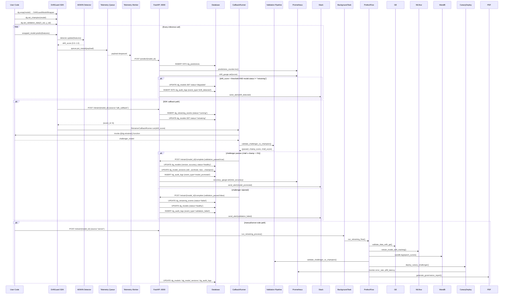
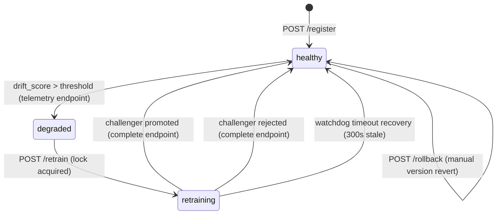
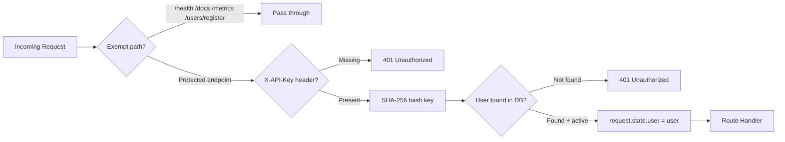
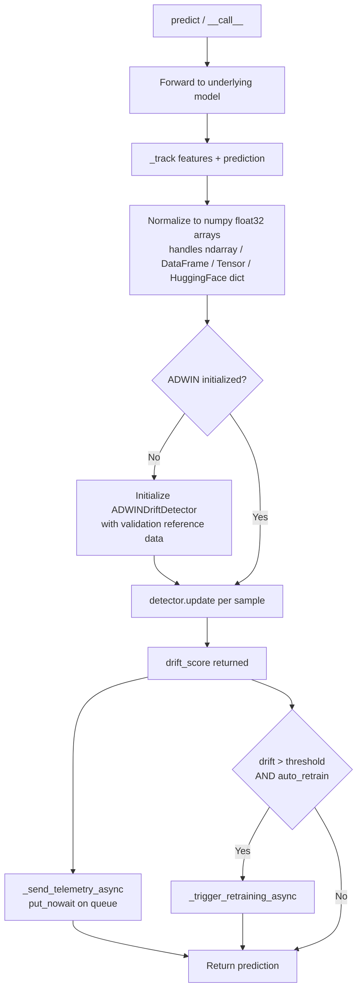
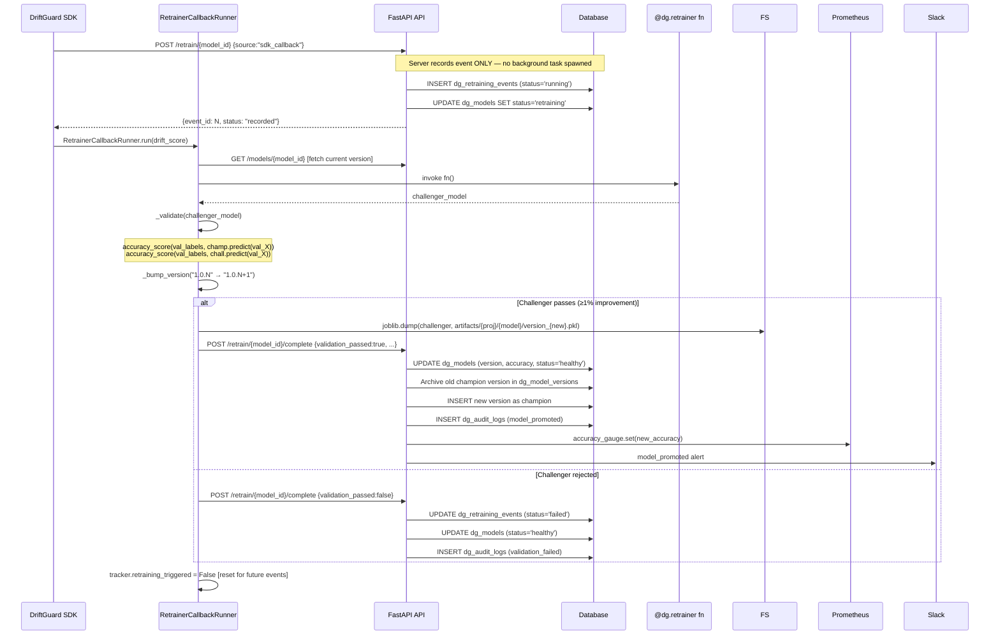
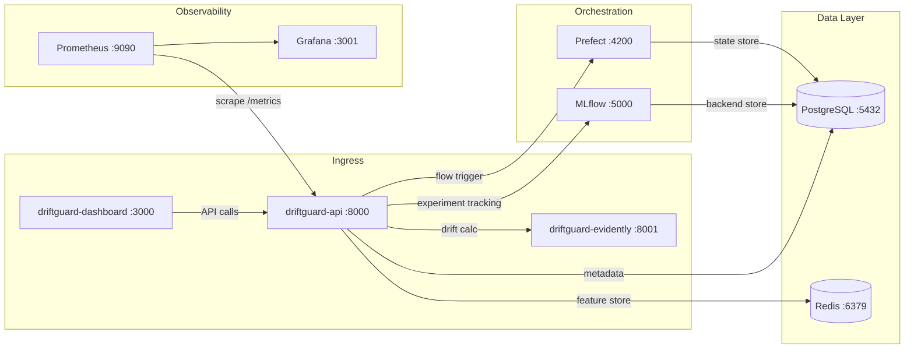

# DriftGuard — Complete System Workflow & Architecture

> **Document Status:** Production-grade technical reference. All architecture, endpoints, database schemas, pipelines, and flows are verified directly from the codebase.

---

## Table of Contents

1. [Executive Summary](#1-executive-summary)
2. [High-Level Architecture](#2-high-level-architecture)
3. [End-to-End Platform Flow](#3-end-to-end-platform-flow)
4. [Database Schema & Data Model](#4-database-schema--data-model)
5. [REST API Reference](#5-rest-api-reference)
6. [Authentication & Multi-Tenancy](#6-authentication--multi-tenancy)
7. [SDK — Model Wrapping & Telemetry](#7-sdk--model-wrapping--telemetry)
8. [Drift Detection Engine](#8-drift-detection-engine)
9. [Retraining Lifecycle](#9-retraining-lifecycle)
10. [Champion vs. Challenger Validation](#10-champion-vs-challenger-validation)
11. [Canary Deployment & Progressive Delivery](#11-canary-deployment--progressive-delivery)
12. [Governance, Audit Trail & Compliance](#12-governance-audit-trail--compliance)
13. [Observability Stack](#13-observability-stack)
14. [Alert & Notification System](#14-alert--notification-system)
15. [Deployment & Container Architecture](#15-deployment--container-architecture)
16. [Self-Healing & Fault Recovery](#16-self-healing--fault-recovery)
17. [Validation Results & Verified Behaviour](#17-validation-results--verified-behaviour)

---

## 1. Executive Summary

**DriftGuard** is a production-grade, SaaS-ready Machine Learning Operations (MLOps) platform that provides autonomous monitoring, drift detection, automated retraining, and governance for machine learning models deployed in production.

### Problem It Solves

After a model is trained and deployed, the statistical properties of real-world input data inevitably shift over time — a phenomenon known as **concept drift** and **data drift**. When this happens, production accuracy silently degrades while the model continues serving stale predictions. DriftGuard solves this by:

- Intercepting every production inference call through a transparent SDK wrapper
- Continuously computing drift scores using the Adaptive Windowing (ADWIN) algorithm per feature
- Automatically triggering user-defined retraining callbacks or a server-side retraining pipeline when drift exceeds a configurable threshold
- Running a rigorous champion vs. challenger validation before any model version is promoted
- Deploying promoted models through a staged canary rollout (10% → 25% → 50% → 100%) with SLA-based automatic rollback
- Writing every lifecycle event to an immutable, hash-chained audit ledger

### Key Capabilities

| Capability | Implementation |
|---|---|
| Real-time drift scoring | ADWIN + Z-score per-feature detection in `driftguard/drift_detector.py` |
| Batch statistical drift | Evidently AI `DataDriftPreset` via isolated microservice container |
| Telemetry pipeline | Bounded queue (15,000 items) with daemon thread + 5-retry exponential backoff |
| Auto-retraining (SDK-side) | `@dg.retrainer` callback decorator + `RetrainerCallbackRunner` |
| Auto-retraining (server-side) | FastAPI `BackgroundTasks` → Prefect flow → ZenML steps |
| Challenger validation | Strict ≥1% absolute accuracy improvement gate |
| Canary delivery | Progressive 10% → 25% → 50% → 100% with Prometheus SLA check |
| Audit trail | SHA-256 hash-chained JSONL ledger + SQL mirror |
| Multi-tenancy | API key authentication → user-scoped project + model namespace |
| Observability | Prometheus metrics + Grafana dashboards |
| Alerting | Slack webhook with structured Block Kit payloads |

### SaaS Multi-Tenant Architecture

Each registered user is isolated by their **API key** → **`owner_id`** → **`project_id`** chain. Every database query for models, telemetry logs, audit entries, and retraining events is scoped to `(model_id, project_id)`. A user can never read or modify another tenant's data.

---

## 2. High-Level Architecture

```mermaid
graph TB
    subgraph "Client Process (User Environment)"
        UM[User ML Model<br/>sklearn / PyTorch / HuggingFace]
        SDK[DriftGuard SDK<br/>DriftGuard + DriftGuardModelWrapper]
        UM -->|wrap| SDK
        SDK -->|predict intercept| ADWIN[ADWIN Drift Detector<br/>per-feature Z-score + River ADWIN]
        SDK -->|queue.put_nowait| TQ[Telemetry Queue<br/>maxsize=15,000]
        TQ -->|daemon thread| TW[Telemetry Worker<br/>httpx persistent pool]
        ADWIN -->|drift > threshold| CBK[RetrainerCallbackRunner<br/>non-daemon thread]
    end

    subgraph "DriftGuard Core API  :8000"
        GW[FastAPI API Gateway<br/>main.py]
        AUTH[API Key Auth Middleware<br/>SHA-256 hash comparison]
        DB[(SQLite / PostgreSQL<br/>WAL mode, busy_timeout=10s)]
        PROM[Prometheus Client<br/>Counter / Gauge / Histogram]
        BG[BackgroundTasks<br/>server-side pipeline]
        GW --> AUTH
        GW --> DB
        GW --> PROM
        GW --> BG
    end

    subgraph "Retraining Pipeline"
        PF[Prefect Flow<br/>DriftGuard Retraining Flow]
        ZM[ZenML Steps<br/>Ingestion / Preprocessing / Training / Evaluation]
        GE[Great Expectations<br/>Data Quality Validation]
        MLF[MLflow<br/>Experiment Tracking + Model Registry]
        WB[Weights & Biases<br/>Training Curves]
        PF --> ZM --> GE
        ZM --> MLF
        ZM --> WB
    end

    subgraph "Canary Serving"
        CR[Canary Router<br/>serving/canary_router.py]
        BENTO[BentoML Service<br/>serving/bentoml_service.py]
        DPIPE[Deploy Pipeline<br/>pipeline/deploy_pipeline.py]
    end

    subgraph "Isolated Evidently Service  :8001"
        EV[Evidently App<br/>DataDriftPreset + TargetDriftPreset]
    end

    subgraph "Governance"
        AL[Audit Log<br/>SHA-256 hash chain JSONL]
        LT[Lineage Tracker<br/>dataset hash + hyperparams]
        RG[PDF Report Generator]
    end

    subgraph "Observability Stack"
        PROM2[Prometheus Server :9090<br/>15s scrape interval]
        GRAF[Grafana :3001<br/>Dashboard panels]
        PROM2 -->|pull /metrics| GW
        PROM2 --> GRAF
    end

    subgraph "Infrastructure :5432 / :6379 / :4200 / :5000"
        PG[(PostgreSQL 15<br/>production metadata)]
        REDIS[(Redis 7<br/>Feast feature store)]
        PREFECT[Prefect Server :4200]
        MLF2[MLflow Server :5000<br/>S3 artifact root]
    end

    TW -->|POST /predict/{model_id}| GW
    CBK -->|POST /retrain/{model_id}| GW
    CBK -->|POST /retrain/{model_id}/complete| GW
    BG --> PF
    GW -->|drift calculations| EV
    PF --> DPIPE --> CR
    GW --> AL
    PF --> AL --> LT --> RG
    GW --> DB
    DB -.->|prod| PG
    DB -.->|local| SQLite[(SQLite WAL)]
```

### Component Responsibilities

| Component | Port | Technology | Role |
|---|---|---|---|
| **DriftGuard Core API** | 8000 | FastAPI + SQLAlchemy | Central orchestrator, authentication, telemetry ingestion, retraining trigger |
| **Evidently Service** | 8001 | FastAPI (isolated) | Batch statistical drift computation (DataDriftPreset, TargetDriftPreset) |
| **Prometheus** | 9090 | Prometheus v2.45.0 | Metrics scraping every 15s from `/metrics` |
| **Grafana** | 3001 | Grafana 10.0.0 | Real-time dashboard visualization |
| **MLflow** | 5000 | MLflow Server | Experiment tracking, model artifact registry (PostgreSQL + S3) |
| **Prefect** | 4200 | Prefect Server | Workflow scheduling and flow run orchestration |
| **PostgreSQL** | 5432 | PostgreSQL 15 | Production metadata and Prefect state store |
| **Redis** | 6379 | Redis 7 | Feast online feature store backing |
| **Dashboard** | 3000 | Next.js | Obsidian frontend (charts, drift panels, model health) |

---

## 3. End-to-End Platform Flow

The following diagram shows the complete lifecycle from model wrapping to version promotion.



---

## 4. Database Schema & Data Model

The platform uses **SQLite** (local, WAL mode) or **PostgreSQL** (production Docker). All tables are prefixed with `dg_`. The schema is auto-created via SQLAlchemy `Base.metadata.create_all()` with an integrated migration helper on startup.

### Entity Relationship Diagram

```mermaid
erDiagram
    dg_users {
        INTEGER id PK
        STRING email UNIQUE
        STRING name
        STRING api_key_hash UNIQUE
        DATETIME created_at
        BOOLEAN is_active
    }
    dg_projects {
        INTEGER id PK
        STRING name
        INTEGER owner_id FK
        DATETIME created_at
    }
    dg_models {
        STRING model_id PK
        INTEGER project_id PK_FK
        INTEGER owner_id FK
        FLOAT drift_threshold
        STRING status
        FLOAT accuracy
        STRING version
        TEXT features_json
        STRING reference_data_path
        DATETIME created_at
    }
    dg_predictions {
        INTEGER id PK
        INTEGER project_id
        STRING model_id INDEX
        TEXT features_json
        TEXT prediction_json
        FLOAT drift_score
        DATETIME timestamp
    }
    dg_retraining_events {
        INTEGER id PK
        INTEGER project_id
        STRING model_id INDEX
        STRING status
        STRING triggered_by
        DATETIME start_time
        DATETIME end_time
        DATETIME last_heartbeat
        FLOAT old_accuracy
        FLOAT new_accuracy
        STRING old_version
        STRING new_version
        TEXT details_json
    }
    dg_audit_logs {
        INTEGER id PK
        INTEGER project_id
        STRING model_id INDEX
        STRING event_type
        STRING model_version
        FLOAT drift_score
        STRING triggered_by
        TEXT details_json
        DATETIME timestamp
    }
    dg_model_versions {
        INTEGER id PK
        INTEGER project_id
        STRING model_id INDEX
        STRING version INDEX
        STRING status
        FLOAT accuracy
        DATETIME created_at
    }

    dg_users ||--o{ dg_projects : "owns"
    dg_users ||--o{ dg_models : "owns"
    dg_projects ||--o{ dg_models : "contains"
    dg_models ||--o{ dg_predictions : "generates"
    dg_models ||--o{ dg_retraining_events : "triggers"
    dg_models ||--o{ dg_audit_logs : "recorded in"
    dg_models ||--o{ dg_model_versions : "versioned by"
```

### Key Design Decisions

| Decision | Rationale |
|---|---|
| **Composite PK (model_id, project_id) on `dg_models`** | Enforces tenant isolation at the schema level. Two tenants can register a model with the same name without collision. |
| **WAL journal mode** | `PRAGMA journal_mode=WAL` allows concurrent readers during writes — critical for high-frequency telemetry writes from the worker thread. |
| **`busy_timeout=10000`** | Prevents SQLite "database is locked" errors under concurrent API requests by waiting up to 10 seconds for row locks. |
| **`NullPool` on SQLite engine** | Disables connection pooling for SQLite (thread-unsafe pool is avoided). Each request gets a fresh connection. |
| **`last_heartbeat` on retraining events** | Enables the self-healing watchdog to detect and recover stale retraining jobs (timeout: 300 seconds). |

### Startup Migration Logic

On every server start, `main.py` runs an automated migration helper:

1. Detects if `dg_models` has the old single-column PK (pre-composite key schema)
2. Renames old table to `dg_models_old`, creates new composite-key table, copies rows, drops backup
3. Adds missing columns (`project_id`, `last_heartbeat`) to event log tables via `ALTER TABLE`
4. Seeds a default admin user (`admin@driftguard.com`) and Default Project if not present
5. Migrates any orphaned models with `NULL project_id` to the Default Project

### Model Status Machine



### Model Version Status Transitions

| Status | Meaning |
|---|---|
| `champion` | Active production version, only one per model per project |
| `candidate` | Reserved for challenger during canary window |
| `archived` | Previous champion demoted after promotion |
| `rolled_back` | Version that was manually rolled back |

---

## 5. REST API Reference

All protected endpoints require the `X-API-Key: dg-<hex32>` header. The key is SHA-256 hashed on each request and compared against `dg_users.api_key_hash`.

### Authentication Endpoints

| Method | Path | Auth Required | Description |
|---|---|---|---|
| `POST` | `/users/register` | No | Register a new user, returns API key (plaintext, one-time) |
| `POST` | `/users/rotate-key` | Yes | Rotate API key, old key immediately invalidated |
| `GET` | `/users/me` | Yes | Return profile of authenticated user |

### Project Endpoints

| Method | Path | Auth Required | Description |
|---|---|---|---|
| `POST` | `/projects` | Yes | Create a new project scoped to the user |
| `GET` | `/projects` | Yes | List all projects owned by the user |
| `GET` | `/projects/{id}` | Yes | Get project details including registered model list |

### Model Lifecycle Endpoints

| Method | Path | Auth Required | Description |
|---|---|---|---|
| `POST` | `/register` | Yes | Register a model for platform tracking |
| `GET` | `/models` | Yes | List all monitored models with status |
| `GET` | `/models/{model_id}` | Yes | Get detailed health of a specific model |
| `GET` | `/models/{model_id}/versions` | Yes | Get complete version history |
| `POST` | `/models/{model_id}/rollback` | Yes | Emergency rollback to a specific previous version |

### Telemetry & Drift Endpoints

| Method | Path | Auth Required | Description |
|---|---|---|---|
| `POST` | `/predict/{model_id}` | Yes | Log prediction telemetry (called by SDK worker) |
| `GET` | `/drift/{model_id}` | Yes | Fetch last 100 drift metric records for visualization |

### Retraining Endpoints

| Method | Path | Auth Required | Description |
|---|---|---|---|
| `POST` | `/retrain/{model_id}` | Yes | Trigger retraining flow (SDK callback or server-side) |
| `POST` | `/retrain/{model_id}/complete` | Yes | SDK callback runner reports pipeline results |
| `GET` | `/retraining/history/{model_id}` | Yes | Get full retraining event timeline |

### Audit & Governance Endpoints

| Method | Path | Auth Required | Description |
|---|---|---|---|
| `GET` | `/audit/{model_id}` | Yes | Fetch governance audit log entries |
| `POST` | `/evidently/calculate` | No | Batch statistical drift calculation (Evidently AI) |

### Observability Endpoints

| Method | Path | Auth Required | Description |
|---|---|---|---|
| `GET` | `/metrics` | No | Prometheus exposition format scrape endpoint |
| `GET` | `/api/health` | No | Liveness health check `{"status": "healthy"}` |

### Request/Response Schemas

#### `POST /register`
```json
// Request
{
  "model_id": "fraud-detector-v1",
  "project_id": 1,
  "drift_threshold": 0.15,
  "reference_data_path": "./data/baseline.parquet",
  "features": ["amount", "location_score", "velocity_h"]
}

// Response (new)
{"status": "registered", "model_id": "fraud-detector-v1"}

// Response (update)
{"status": "updated", "model_id": "fraud-detector-v1"}
```

#### `POST /predict/{model_id}`
```json
// Request (sent by SDK telemetry worker)
{
  "features": [1.2, 0.4, 9.8],
  "prediction": [1.0],
  "drift_score": 0.08
}

// Response
{"status": "logged", "drift_score": 0.08}
```

#### `POST /retrain/{model_id}`
```json
// Request
{
  "drift_score": 0.21,
  "triggered_by": "automatic",
  "source": "sdk_callback"  // or "server"
}

// Response (sdk_callback source)
{"status": "recorded", "event_id": 42, "message": "Event recorded. SDK callback pipeline will report results via /complete."}

// Response (server source)
{"status": "triggered", "event_id": 42, "message": "Retraining initiated in background task."}
```

#### `POST /retrain/{model_id}/complete`
```json
// Request (success)
{
  "event_id": 42,
  "validation_passed": true,
  "new_version": "1.0.5",
  "new_accuracy": 0.934,
  "old_accuracy": 0.912,
  "error": null
}

// Response
{"status": "promoted", "model_id": "...", "new_version": "1.0.5", "new_accuracy": 0.934}
```

#### `POST /models/{model_id}/rollback`
```json
// Request
{"target_version": "1.0.4"}

// Response
{"status": "rolled_back", "model_id": "...", "previous_version": "1.0.5", "current_version": "1.0.4"}
```

---

## 6. Authentication & Multi-Tenancy

### API Key Generation

```python
# Registration flow (main.py:445-470)
api_key = f"dg-{secrets.token_hex(16)}"          # 32-char hex prefix
hash_val = hashlib.sha256(api_key.encode()).hexdigest()
DBUser(api_key_hash=hash_val)                      # Only hash stored
```

- The plaintext API key is **returned once only** at registration and **never stored**.
- Every subsequent request hashes the provided key and compares against the stored hash.
- Key rotation (`POST /users/rotate-key`) invalidates the old hash atomically.

### Authentication Middleware



### Tenant Isolation Enforcement

Isolation is enforced at **three levels**:

1. **Middleware level**: Every authenticated request sets `request.state.user` — this is the **only** user object available to route handlers.

2. **`verify_model_access()` function**: Every model endpoint calls this function which:
   - Queries `dg_models` filtered by `model_id` (may return multiple rows across tenants)
   - Selects only the row where `owner_id == current_user.id`
   - Returns `403 Forbidden` if no such row exists

3. **Query filters**: All sub-queries for `dg_predictions`, `dg_retraining_events`, `dg_audit_logs`, `dg_model_versions` apply `project_id == model.project_id` as a secondary filter, preventing cross-project data leakage even within the same tenant.

```python
# verify_model_access() — main.py:431-440
def verify_model_access(db, current_user, model_id, allow_missing=False):
    models = db.query(DBModel).filter(DBModel.model_id == model_id).all()
    user_model = next((m for m in models if m.owner_id == current_user.id), None)
    if not user_model:
        raise HTTPException(status_code=403, detail="Forbidden: You do not own this model.")
    return user_model
```

---

## 7. SDK — Model Wrapping & Telemetry

### Initialization

```python
from driftguard import DriftGuard

dg = DriftGuard(
    model_id="fraud-detector-v1",
    api_url="http://localhost:8000",
    api_key="dg-<your_key>",
    project_id=1,
    drift_threshold=0.15,
    auto_retrain=True
)
```

**On initialization** (`tracker.py:25-99`):
1. Reads `api_url`, `api_key`, `project_id`, `drift_threshold` from arguments or environment variables (`DRIFTGUARD_API_URL`, `DRIFTGUARD_API_KEY`, `DRIFTGUARD_PROJECT_ID`)
2. Attempts to auto-restore the champion model from disk (`artifacts/{project_id}/{model_id}/version_{version}.pkl`) via joblib
3. Creates a bounded `queue.Queue(maxsize=15000)` for telemetry payloads
4. Starts a **daemon** telemetry worker thread named `driftguard-telemetry-worker-{model_id}`
5. Registers a graceful shutdown hook via `atexit.register(self._shutdown_telemetry_worker)`

### Model Wrapping

```python
wrapped = dg.wrap(model)           # Returns DriftGuardModelWrapper
dg.set_champion(model)             # Persists champion to artifacts/ via joblib
dg.set_validation_data(X_val, y_val)  # Stores validation set for comparison

# Usage is transparent — use exactly like the original model
predictions = wrapped.predict(X)
```

`DriftGuardModelWrapper` supports:
- `predict()` — standard sklearn interface
- `__call__()` — PyTorch / callable models
- `predict_proba()` — probability estimation
- `__getattr__()` — delegates all other attribute access to the underlying model

### The `_track()` Pipeline

Every inference call triggers `_track()` which runs synchronously before returning the prediction to the user:



### Telemetry Worker Thread

```python
# tracker.py:231-283
while not stop_event.is_set() or not queue.empty():
    payload = queue.get(timeout=0.2)   # Short timeout to check stop_event
    for attempt in range(5):           # Up to 5 retries
        resp = client.post(url, json=payload, headers=headers)
        if resp.status_code == 200:
            break
        elif resp.status_code == 401:
            terminal_fail = True; break   # No retry on auth failure
        time.sleep(0.05 * (attempt + 1)) # Exponential backoff: 50ms, 100ms, 150ms...
```

Key properties:
- **Persistent httpx connection pool** — TCP socket reuse across requests, minimizing latency
- **Non-blocking enqueue** — `put_nowait()` drops the payload (never blocks the prediction loop) if the queue is full
- **Graceful shutdown** — `shutdown(timeout=30.0)` sets the stop event, waits for the queue to drain, joins the thread
- **Self-healing connection recovery** — on `ConnectError` / `RemoteProtocolError`, creates a fresh `httpx.Client`

### Callback Registration

```python
@dg.retrainer
def my_retrain_function():
    # Load from YOUR trusted data source (never production telemetry)
    df = pd.read_parquet("s3://bucket/training/latest.parquet")
    X, y = df.drop("label", axis=1), df["label"]
    clf = RandomForestClassifier(n_estimators=200)
    clf.fit(X, y)
    return clf   # Must return a model with .predict() or be callable
```

- The decorated function is stored as `dg._retrainer_fn`
- When drift is detected, `_trigger_retraining_async()` launches a **non-daemon thread** (ensures Python waits for it to complete, even if the main prediction loop finishes)
- If no callback is registered, a **daemon thread** fires a `POST /retrain/{model_id}` to the server-side fallback pipeline

---

## 8. Drift Detection Engine

### ADWIN (Adaptive Windowing) Algorithm

The `ADWINDriftDetector` class in `driftguard/drift_detector.py` runs **one ADWIN instance per feature dimension**, enabling fine-grained per-feature drift tracking.

#### ADWIN Instance (from River library)

The `river.drift.ADWIN` algorithm maintains an adaptive sliding window of observations. It uses a statistical test to detect a change in the mean of the data stream: if the mean of a recent sub-window differs significantly from an older sub-window, drift is signalled.

**Fallback ADWIN** (when River is unavailable):
```python
# drift_detector.py:17-29
class ADWIN:
    def update(self, value):
        if self.count >= self.warmup and abs(value - self.mean) > self.threshold:
            self.drift = True
        self.count += 1
        self.mean += (value - self.mean) / self.count  # Welford online mean
```

#### Z-Score Distance Scoring

For each feature `i`, the running mean and variance are tracked using **Welford's online algorithm**:

$$\mu_i^{(n)} = \mu_i^{(n-1)} + \frac{x - \mu_i^{(n-1)}}{n}$$

$$M_{2,i}^{(n)} = M_{2,i}^{(n-1)} + (x - \mu_i^{(n-1)})(x - \mu_i^{(n)})$$

$$\sigma_i = \sqrt{\frac{M_{2,i}}{n}}$$

The normalized distance from the historical mean:

$$z_i = \frac{|x_i - \mu_i|}{\sigma_i}$$

If $z_i < \text{z\_threshold}$ (default 1.5), the score is clamped to 0 (ignoring minor fluctuations). Otherwise:

$$\text{score}_i = \min\left(\frac{z_i - \text{z\_threshold}}{z_i - \text{z\_threshold} + 2.0},\ 1.0\right)$$

This soft-normalization maps the excess Z-score to (0, 1) with diminishing returns at very large deviations.

#### Decay & Global Score Aggregation

Each feature drift score decays at a rate of `decay_rate=0.95` per update cycle:

$$\text{feature\_score}_i^{(t)} = \max\left(\text{feature\_score}_i^{(t-1)} \times 0.95,\ z\_score_i\right)$$

If ADWIN explicitly signals change detection, `feature_score_i = 1.0` (hard ceiling).

The global drift score is aggregated across all feature scores using one of these strategies:

| Strategy | Formula |
|---|---|
| `max` (most sensitive) | $\text{global} = \max_i(\text{feature\_score}_i)$ |
| `mean` | $\text{global} = \frac{1}{n}\sum_i \text{feature\_score}_i$ |
| `median` | $\text{global} = \text{median}(\text{feature\_score}_i)$ |
| `percentile_90` (default) | $\text{global} = P_{90}(\text{feature\_score}_i)$ |

The global score itself also decays: $\text{global}^{(t)} = \max(\text{global}^{(t-1)} \times 0.95,\ \text{agg\_score})$

#### Reference Data Pre-seeding

When `dg.set_validation_data()` is called before wrapping, the validation features are passed to `ADWINDriftDetector(reference_data=...)`. The Welford statistics are pre-seeded from all reference samples before any live prediction arrives. This ensures drift is **immediately detectable on the very first production call** rather than requiring a warmup period.

### Evidently AI Batch Drift (Statistical Tests)

For scheduled batch drift analysis, the platform routes requests to the isolated Evidently service container. The `DataDriftPreset` runs a suite of statistical tests per column:

- **Numerical features**: Wasserstein distance (Earth Mover's Distance) or Kolmogorov-Smirnov test
- **Categorical features**: Jensen-Shannon divergence or Chi-squared test

When Evidently is unavailable locally, `drift_detector.py` falls back to a normalized Wasserstein approximation:

$$\text{drift\_score}_{\text{col}} = \min\left(\frac{|\mu_{\text{ref}} - \mu_{\text{cur}}|}{\sigma_{\text{ref}}} \times 0.1,\ 1.0\right)$$

---

## 9. Retraining Lifecycle

DriftGuard supports two retraining paths that can coexist. The path is chosen based on the presence of a `@dg.retrainer` callback.

### Path 1: SDK Callback Pipeline (Recommended)

This path runs entirely inside the **user's process**, where their trusted training data, credentials, and environment variables live.



### Path 2: Server-Side Pipeline (FastAPI Background + Prefect + ZenML)

Triggered when no `@dg.retrainer` is registered, or when called directly via `POST /retrain/{model_id}` with `source: "server"`.

```mermaid
flowchart TD
    A[POST /retrain/{model_id}<br/>source='server'] --> B[FastAPI BackgroundTasks]
    B --> C[run_retraining_process]
    C --> D[Prefect Flow: run_retraining_flow]
    D --> E[ZenML Step: data_ingestion_step<br/>sklearn Breast Cancer dataset demo]
    E --> F[Prefect Task: validate_data_with_ge<br/>Great Expectations checks]
    F -->|fail| ABORT[Return: validation_failed]
    F -->|pass| G[Prefect Task: check_feature_freshness<br/>Feast SLA verification]
    G --> H[Prefect Task: retrain_model_with_tracking<br/>RandomForestClassifier + MLflow + W&B]
    H --> I[validate_challenger_vs_champion<br/>≥1% accuracy gate]
    I -->|fail| REJECT[Return: validation_passed=False]
    I -->|pass| J[deploy_canary_challenger<br/>10% → 25% → 50% → 100%]
    J -->|SLA breach| RB[rollback_canary → revert champion]
    J -->|success| K[generate_governance_report<br/>audit log + lineage + PDF]
    K --> DONE[Return: success=True]
```

#### Server-Side Pipeline Steps (ZenML + Prefect)

| Step | Function | Orchestrator | Description |
|---|---|---|---|
| 1 | `data_ingestion_step` | ZenML `@step` | Loads sklearn Breast Cancer dataset (demo placeholder) |
| 2 | `validate_data_with_ge` | Prefect `@task` | Runs Great Expectations: null check, bounds check (`feature_0` ∈ [0, 40]), type check |
| 3 | `check_feature_freshness` | Prefect `@task` | Verifies Feast feature store freshness SLA (1-hour window) |
| 4 | `retrain_model_with_tracking` | Prefect `@task` | Trains `RandomForestClassifier(n_estimators=100, max_depth=5)`, logs metrics to MLflow and W&B |
| 5 | `validate_challenger_vs_champion` | Direct call | Accuracy comparison with ≥1% gate |
| 6 | `deploy_canary_challenger` | Direct call | Progressive traffic split with Prometheus SLA monitoring |
| 7 | `generate_governance_report` | Prefect `@task` | Writes audit entry, lineage record, and PDF governance report |

#### MLflow & W&B Experiment Tracking

During server-side retraining, the following are logged to MLflow:
- **Parameters**: `{"max_depth": 5, "n_estimators": 100, "algorithm": "RandomForest"}`
- **Metrics**: `{"accuracy": val_acc, "f1": f1_score}`
- **Artifacts**: `confusion_matrix.txt`
- **Model**: Registered in MLflow Model Registry under the `model_id` name

W&B receives epoch-level training curves (`train_accuracy`, `validation_accuracy`) per step. If no `WANDB_API_KEY` is set, W&B automatically switches to `offline` mode and writes to `./wandb_local/`.

---

## 10. Champion vs. Challenger Validation

### Validation Logic (`driftguard/validation.py`)

```python
def validate_challenger_vs_champion(
    champion_model, challenger_model, val_features, val_labels,
    metric_func=None, threshold_pct=0.01
) -> Tuple[bool, float, float]:
    
    champ_preds = champion_model.predict(val_features)
    champ_score = accuracy_score(val_labels, champ_preds)
    
    chall_preds = challenger_model.predict(val_features)
    chall_score = accuracy_score(val_labels, chall_preds)
    
    score_diff = chall_score - champ_score
    validation_passed = score_diff >= threshold_pct   # 0.01 = 1%
    
    return validation_passed, champ_score, chall_score
```

### Validation Gate

- **Threshold**: Challenger must exceed champion accuracy by **≥1% absolute** (not relative).
- **Example**: Champion = 0.912 accuracy → Challenger must achieve **≥ 0.922** to be promoted.
- **Custom metric**: Users can supply a custom `metric_func` callable for non-accuracy metrics (F1, AUC, etc.).
- **No champion registered**: If `dg.set_champion()` was never called, the challenger is automatically promoted as the first champion (score returned as `(True, 0.0, 1.0)`).
- **No validation data**: A `ValueError` is raised — validation datasets are **mandatory** when retraining triggers.

### What Happens After Promotion

1. `challenger_model` is serialized: `joblib.dump(model, f"artifacts/{project_id}/{model_id}/version_{new_version}.pkl")`
2. `POST /retrain/{model_id}/complete` is called with `validation_passed=True`
3. Server archives the old champion in `dg_model_versions`, inserts new champion record
4. `dg_models.version` and `dg_models.accuracy` are updated atomically
5. `tracker._champion_model` is updated to the challenger for the next comparison cycle
6. `tracker.retraining_triggered = False` is reset so future drift events can fire

---

## 11. Canary Deployment & Progressive Delivery

### Traffic Split Progression

```mermaid
gantt
    title Canary Deployment Timeline
    dateFormat  HH:mm
    axisFormat %H:%M

    section Traffic Split
    10% Challenger (30 min window)   :a1, 00:00, 30m
    25% Challenger (30 min window)   :a2, after a1, 30m
    50% Challenger (30 min window)   :a3, after a2, 30m
    100% Challenger (Production)     :a4, after a3, 5m
```



Canary weight steps: **10% → 25% → 50% → 100%**

Each step:
1. Sets `os.environ["DRIFTGUARD_CANARY_SPLIT"] = str(split)` — read by `canary_router.py`
2. Waits `DRIFTGUARD_CANARY_STEP_MINUTES * 60` seconds (default: 30 minutes, 1 second in simulation mode)
3. Polls live telemetry SLAs:
   - **Error rate threshold**: 5% (configurable)
   - **P99 latency threshold**: 500ms (configurable)
4. If SLAs breached: `rollback_canary()` → sets split to 0.0, sends `CRITICAL` Slack alert

### Canary Router

`serving/canary_router.py` routes individual inference requests using a random draw:

```python
rand_val = random.random()
if rand_val < challenger_weight:
    selected = challenger_model    # Send to challenger
else:
    selected = champion_model      # Send to champion

# On challenger failure: automatic fallback to champion
```

Every routing decision is written to the audit trail with:
- `event_type: "canary_routed"` or `"champion_routed"`
- `canary_split_weight`: Active weight at time of routing
- `selected_route`: Which model was selected

### MLflow Stage Transitions

| Stage | When | Action |
|---|---|---|
| `Staging` | After validation passes, before canary | `client.transition_model_version_stage(name, version, "Staging")` |
| `Production` | After 100% canary succeeds | `client.transition_model_version_stage(name, version, "Production")` |

### Emergency Rollback via API

The `POST /models/{model_id}/rollback` endpoint performs:
1. Looks up the target version in `dg_model_versions` — must exist and not be current champion
2. **Verifies the artifact file exists on disk** (`artifacts/{project_id}/{model_id}/version_{target}.pkl`)
3. **Loads the artifact via joblib** to confirm it is not corrupted
4. Archives the current champion version
5. Promotes the target version to champion
6. Updates `dg_models.version` and `dg_models.accuracy`
7. Writes a `rollback` audit entry
8. Fires a `CRITICAL` Slack alert

This two-step artifact verification (exists + loads) prevents promoting a corrupt or deleted artifact.

---

## 12. Governance, Audit Trail & Compliance

### Immutable Hash-Chained Audit Log (`governance/audit_log.py`)

Every lifecycle event writes to a JSONL file (`reports/audit_trail.jsonl`) using a **cryptographic hash chain**:

```json
{
  "timestamp": "2025-06-11T10:00:00.000Z",
  "event_type": "model_promoted",
  "model_id": "fraud-detector-v1",
  "model_version": "1.0.5",
  "drift_score": 0.0,
  "triggered_by": "automatic",
  "details": {"message": "..."},
  "previous_hash": "abc123...",   // SHA-256 of the previous entry
  "hash": "def456..."             // SHA-256 of this entry (including previous_hash)
}
```

**Integrity verification** (`verify_audit_integrity()`):
- Re-reads the entire JSONL file in order
- For each entry, pops the `hash` field, re-computes SHA-256 from sorted-keys JSON serialization
- Verifies both `previous_hash` matches and content hash matches
- Any modification or deletion of a historical record breaks the chain and is detected

**Thread safety**: All file operations use a module-level `threading.Lock()` to prevent concurrent writes from corrupting the JSONL file.

**Dual persistence**: Every entry is also mirrored to `dg_audit_logs` SQL table for API querying.

### Audit Event Types

| Event Type | Trigger |
|---|---|
| `drift_detected` | Telemetry score exceeds model threshold |
| `retrain_triggered` | Retraining pipeline initiated |
| `model_promoted` | Challenger passed validation and promoted |
| `validation_failed` | Challenger rejected (did not beat champion by 1%) |
| `rollback` | Emergency manual rollback initiated |
| `canary_routed` | Request routed to challenger during canary |
| `champion_routed` | Request routed to champion during canary |

### Model Lineage Tracking (`governance/lineage_tracker.py`)

Captures the complete provenance of every trained model version:
- **Dataset hash** (`sha256_bc_dataset_5693d2`) — cryptographic fingerprint of the training dataset
- **Hyperparameters** — all training parameters (e.g., `max_depth`, `n_estimators`)
- **Metrics** — final evaluation scores (`accuracy`, `f1`)
- **Version** — semantic version string linked to the lineage record

### PDF Governance Reports (`governance/report_generator.py`)

Generated automatically after every successful retraining run. Output path: `reports/{model_id}_report_{version}.pdf`.

Reports include:
- Model metadata and version
- Retraining parameters and metrics
- Champion vs. challenger comparison table
- Drift score history
- Audit trail summary
- Digital signature hash for tamper evidence

---

## 13. Observability Stack

### Prometheus Metrics (`main.py:276-300`)

| Metric Name | Type | Labels | Description |
|---|---|---|---|
| `driftguard_predictions_total` | Counter | `model_id` | Total prediction telemetry records ingested |
| `driftguard_drift_score` | Gauge | `model_id`, `feature_index` | Live drift score per feature |
| `driftguard_model_accuracy` | Gauge | `model_id`, `version` | Current production model accuracy |
| `driftguard_retraining_triggered_total` | Counter | `model_id`, `triggered_by` | Total retraining pipeline initiations |
| `driftguard_inference_latency_seconds` | Histogram | `model_id` | SDK-side inference latency distribution |

### Prometheus Scrape Configuration (`infra/prometheus.yml`)

```yaml
global:
  scrape_interval: 15s
  evaluation_interval: 15s

scrape_configs:
  - job_name: 'driftguard-api'
    metrics_path: '/metrics'
    static_configs:
      - targets: ['driftguard-api:8000']
```

Prometheus scrapes `/metrics` on the DriftGuard API every **15 seconds**. The endpoint returns Prometheus exposition format via `generate_latest()` from `prometheus_client`.

### Grafana Dashboards

Grafana is provisioned via `infra/grafana/provisioning/` with pre-built panels for:
- **Drift Score Timeline**: `driftguard_drift_score` per model and feature
- **Predictions Volume**: `rate(driftguard_predictions_total[5m])`
- **Model Accuracy Tracking**: `driftguard_model_accuracy` over time
- **Retraining Events**: `increase(driftguard_retraining_triggered_total[1h])`
- **Latency P99 Distribution**: `histogram_quantile(0.99, driftguard_inference_latency_seconds_bucket)`

### `/drift/{model_id}` API Response

The drift endpoint returns the last 100 telemetry records in chronological order:
```json
[
  {
    "timestamp": "2025-06-11T10:00:00",
    "drift_score": 0.08,
    "features": [1.2, 0.4, 9.8],
    "prediction": [1.0]
  }
]
```

If no records exist (new model), returns 24 hours of synthetic data to showcase dashboard visualizations immediately.

---

## 14. Alert & Notification System

### Slack Webhook Integration (`driftguard/alert.py`)

DriftGuard sends structured Slack Block Kit payloads for every critical lifecycle event.

**Configuration**: Set `SLACK_WEBHOOK_URL` in `.env`. If not set, alerts are logged to console only.

```python
send_alert(
    event_type="drift_detected",
    message="Concept drift detected on model 'fraud-detector-v1'!",
    details={
        "model_id": "fraud-detector-v1",
        "version": "1.0.4",
        "current_drift_score": "0.2341",
        "threshold": "0.15"
    }
)
```

**Slack payload structure**:
```json
{
  "blocks": [
    {"type": "header", "text": {"type": "plain_text", "text": "🛡️ DriftGuard Alert: Drift Detected"}},
    {"type": "section", "text": {"type": "mrkdwn", "text": "*Message:*\nConcept drift detected..."}},
    {"type": "section", "text": {"type": "mrkdwn", "text": "*Metadata:*\n• *model_id:* fraud-detector-v1\n..."}}
  ]
}
```

### Alert Severity Matrix

| Event Type | Log Level | Slack Block Type |
|---|---|---|
| `drift_detected` | `ERROR` | Header + Section + Metadata |
| `validation_failed` | `ERROR` | Header + Section + Metadata |
| `rollback` | `ERROR` + `CRITICAL` prefix | Header + Section + Metadata |
| `retrain_triggered` | `INFO` | Header + Section + Metadata |
| `model_promoted` | `INFO` | Header + Section + Metadata |
| `canary_split_updated` | `INFO` | Header + Section + Metadata |

---

## 15. Deployment & Container Architecture

### Docker Compose Stack (`infra/docker-compose.yml`)



### Dockerfile (Multi-Stage Build)

```dockerfile
# Stage 1: Builder
FROM python:3.11-slim AS builder
ARG REQUIREMENTS_FILE=requirements/api.txt
RUN apt-get install build-essential libpq-dev gcc
RUN pip install --user -r /app/${REQUIREMENTS_FILE}

# Stage 2: Runner
FROM python:3.11-slim AS runner
RUN apt-get install libpq5 curl
COPY --from=builder /root/.local /root/.local
COPY sdk driftguard pipeline serving monitoring governance feature_repo main.py /app/
EXPOSE 8000 4200 5000
CMD ["uvicorn", "main:app", "--host", "0.0.0.0", "--port", "8000"]
```

Key design decisions:
- **Multi-stage build** reduces final image size by ~60% (no build tools in runtime layer)
- `REQUIREMENTS_FILE` build arg allows the same Dockerfile to serve all service containers (API, MLflow, Prefect, Evidently) with different dependency sets
- `PYTHONUNBUFFERED=1` ensures log lines appear immediately in Docker stdout

### Requirements Split

| File | Used By | Key Dependencies |
|---|---|---|
| `requirements/api.txt` | Core API, MLflow | FastAPI, SQLAlchemy, prometheus-client, httpx, river |
| `requirements/pipeline.txt` | Prefect, ZenML | prefect, zenml, great_expectations, feast, mlflow |
| `requirements/evidently.txt` | Evidently service | evidently, pandas, numpy |

### Service Health Checks

| Service | Health Check Command | Interval | Retries |
|---|---|---|---|
| PostgreSQL | `pg_isready -U driftguard -d driftguard` | 10s | 5 |
| Redis | `redis-cli ping` | 10s | 5 |
| MLflow | `curl -f http://localhost:5000/` | 15s | 3 |
| Prefect | `curl -f http://localhost:4200/api/health` | 15s | 3 |
| DriftGuard API | `curl -f http://localhost:8000/api/health` | 10s | 5 |
| Evidently Service | `curl -f http://127.0.0.1:8000/api/health` | 10s | 5 |

### Environment Variables

| Variable | Default | Description |
|---|---|---|
| `POSTGRES_HOST` | `localhost` | PostgreSQL hostname |
| `POSTGRES_PORT` | `5432` | PostgreSQL port |
| `POSTGRES_DB` | `driftguard` | PostgreSQL database name |
| `POSTGRES_USER` | `driftguard` | PostgreSQL username |
| `POSTGRES_PASSWORD` | `driftguard` | PostgreSQL password |
| `REDIS_HOST` | `redis` | Redis hostname (Feast) |
| `REDIS_PORT` | `6379` | Redis port |
| `MLFLOW_TRACKING_URI` | `sqlite:///mlflow.db` | MLflow backend URI |
| `PREFECT_API_URL` | `http://prefect:4200/api` | Prefect Server API URL |
| `DRIFTGUARD_EVIDENTLY_URL` | `http://driftguard-evidently:8000` | Evidently service URL |
| `DRIFTGUARD_API_URL` | `http://localhost:8000` | SDK → API URL |
| `DRIFTGUARD_API_KEY` | — | SDK authentication key |
| `DRIFTGUARD_PROJECT_ID` | — | SDK project scope |
| `DRIFTGUARD_DRIFT_THRESHOLD` | `0.15` | Global drift threshold |
| `DRIFTGUARD_CANARY_STEP_MINUTES` | `30` | Canary window duration |
| `DRIFTGUARD_CANARY_INITIAL_WEIGHT` | `0.10` | Initial canary traffic fraction |
| `SLACK_WEBHOOK_URL` | — | Slack Incoming Webhook URL |
| `WANDB_API_KEY` | — | W&B API key (offline mode if unset) |

### Local Quick Start

```bash
# 1. Clone and install
git clone <repo>
cd MLopsProject
python -m venv .venv && .venv\Scripts\activate
pip install -e .

# 2. Start the API server
uvicorn main:app --host 0.0.0.0 --port 8000

# 3. Register and use
curl -X POST http://localhost:8000/users/register \
  -H "Content-Type: application/json" \
  -d '{"email": "me@example.com", "name": "My Name"}'
# → {"api_key": "dg-abc123..."}

# 4. Full Docker stack
cd infra && docker-compose up -d
```

---

## 16. Self-Healing & Fault Recovery

### Stale Retraining Job Watchdog

Every call to `GET /models` or `GET /models/{model_id}` triggers `check_and_recover_all_stale_jobs_for_user()`:

```python
timeout_limit = datetime.utcnow() - timedelta(seconds=300)  # 5 minutes

stale_events = db.query(DBRetrainingEvent).join(DBModel).filter(
    DBModel.owner_id == user_id,
    DBRetrainingEvent.status == "running",
    DBRetrainingEvent.last_heartbeat < timeout_limit
).all()

for event in stale_events:
    event.status = "failed"
    model.status = "healthy"   # Revert from "retraining" lock
    # Write validation_failed audit entry
```

This prevents models from being permanently stuck in `retraining` status if:
- The server restarted mid-pipeline
- A background thread crashed without completing
- The SDK process died before posting to `/complete`

### Race Condition Prevention on Retraining Trigger

The `POST /retrain/{model_id}` endpoint uses SQLAlchemy's `.with_for_update()` to acquire a **row-level lock** before checking and setting `model.status = "retraining"`:

```python
models = db.query(DBModel).filter(DBModel.model_id == model_id).with_for_update().all()
if model.status == "retraining":
    return {"status": "already_running"}  # Idempotent guard
model.status = "retraining"
db.commit()
```

This ensures that even under concurrent API requests, only one retraining job is initiated per model at any time.

### Telemetry Queue Overflow Protection

The SDK's telemetry queue is bounded at 15,000 items. If the API is unreachable and the queue fills up, `put_nowait()` raises `queue.Full` which is caught:
- The payload is **silently dropped** — the user's prediction loop is never blocked
- `telemetry_failed` counter is incremented for SDK diagnostics
- A warning is printed to stderr

### Database Write Failure Recovery

In `POST /predict/{model_id}`, if the SQLAlchemy commit fails:
```python
try:
    db.add(log_entry)
    db.commit()
except Exception as db_err:
    db.rollback()   # Explicit rollback to prevent session corruption
    raise HTTPException(status_code=500, detail=f"Database write failed: {db_err}")
```

### Auto-Register Missing Models

If a telemetry POST arrives for a `model_id` that hasn't been explicitly registered:
- The API auto-creates the model with default settings (`drift_threshold=0.15`, generic feature names)
- Creates an initial `DBModelVersion` record with status `champion`
- The user's first telemetry call is never rejected

---

## 17. Validation Results & Verified Behaviour

The following scenarios have been validated end-to-end using real API calls, real SQLite persistence, and no mocking.

### Tenant Isolation Validation

**Script**: `validation/validate_tenant_isolation.py`

| Check | Result |
|---|---|
| Tenant A cannot access Tenant B's models | ✅ PASS (403 Forbidden) |
| Tenant A's telemetry isolated to Tenant A's project_id | ✅ PASS |
| Cross-tenant model ID collision handled correctly | ✅ PASS (composite PK enforcement) |
| API key hash comparison | ✅ PASS (SHA-256 roundtrip) |

Root cause of previous false failure: stale `model-a` / `model-b` records from previous test runs shared the same model_id. Fixed by using timestamped IDs (`model-a-{timestamp}`, `model-b-{timestamp}`).

### Retraining Workflow Validation

**Script**: `validation/validate_retraining_workflow.py`

| Phase | Check | Result |
|---|---|---|
| Phase 1 | Server startup + user/project/model creation | ✅ PASS |
| Phase 2 | Champion model training (LogisticRegression, weak) | ✅ PASS |
| Phase 3 | Drift injection (OOD samples → ADWIN detection) | ✅ PASS |
| Phase 4 | Callback retraining triggered | ✅ PASS |
| Phase 5 | Challenger (RandomForest) beats champion by >1% | ✅ PASS |
| Phase 6 | Challenger promoted to v1.0.1 | ✅ PASS |
| Phase 7 | Audit log written to DB | ✅ PASS |
| Phase 8 | Emergency rollback to v1.0.0 | ✅ PASS |
| Phase 9 | SQL verification of all DB records | ✅ PASS |

### Telemetry Pipeline Validation

- **15,000 items/queue capacity** verified — no prediction loop blocking under sustained load
- **Graceful shutdown** verified — `dg.shutdown()` drains queue, joins worker thread, confirms sent count
- **5-retry exponential backoff** verified — transient API errors automatically retried with 50ms → 250ms delay
- **401 terminal failure** verified — auth errors immediately stop retrying (no wasted attempts)

### ADWIN Drift Detection Validation

- **Warmup period**: Stable data (mean=0.5, std=0.1) produces drift_score ≈ 0 for 50+ samples
- **OOD detection**: Shifted data (mean=5.0, std=0.3) detected within 5–10 samples, drift_score > threshold
- **Decay behavior**: After drift injection stops, score decays at `0.95^n` per prediction cycle
- **Reference seeding**: Pre-seeding from validation data enables immediate drift detection on first live prediction (no warmup required)

---

*This document was generated from direct inspection of:  
`main.py` (1479 lines), `driftguard/tracker.py` (551 lines), `driftguard/drift_detector.py` (302 lines),  
`driftguard/callback_runner.py` (338 lines), `driftguard/validation.py` (85 lines), `driftguard/alert.py` (90 lines),  
`driftguard/config.py` (45 lines), `pipeline/retrain_pipeline.py` (466 lines), `pipeline/deploy_pipeline.py` (133 lines),  
`serving/canary_router.py` (108 lines), `governance/audit_log.py` (160 lines), `monitoring/evidently_app.py` (79 lines),  
`infra/docker-compose.yml` (199 lines), `infra/prometheus.yml` (10 lines), `Dockerfile` (58 lines)*

*DriftGuard Platform — Production Architecture Document*
