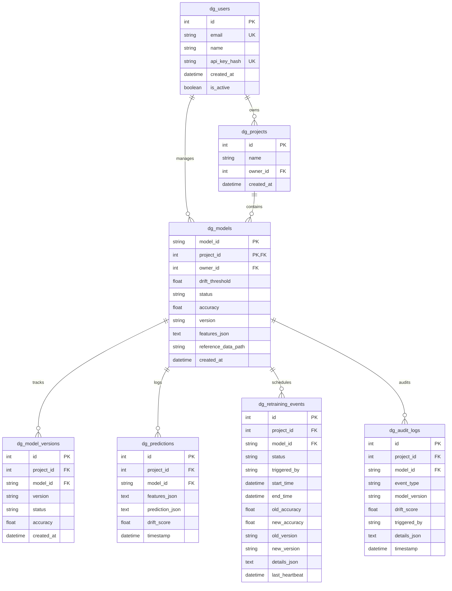

# System Architecture & Tenant Security

This document outlines the core architecture, database relationships, and multi-tenant security layers of the DriftGuard platform.

---

## 1. System Components

DriftGuard splits operations between the **Client SDK (Inference Side)** and the **API Gateway/Server (Registry and Monitoring Side)**:

1. **Client SDK Interceptor**: Wraps local models to calculate real-time concept drift. It places telemetry logs on an internal queue, freeing the inference loop from network bottlenecks.
2. **FastAPI Gateway Server**: Receives telemetry data, maintains the model version history, registers audit logs, and coordinates retraining callbacks.
3. **Database Layer (SQLite/PostgreSQL)**: Stores system records (users, projects, models, versions, logs, retraining schedules).
4. **Artifact Storage**: Serializes and stores trained model pickle files (`.pkl`) inside tenant-isolated directories.

---

## 2. Database Schema ERD

The metadata database stores configuration and telemetry history. Below is the relational mapping of the tables:



---

## 3. Multi-Tenant Security Partitioning

DriftGuard enforces partition boundaries at multiple levels:

* **API Key Auth**: Requests contain the header `X-API-Key`. The gateway hashes this key and validates it against the user records (`dg_users`).
* **Model Access Validation**: Access to model endpoints is checked using `verify_model_access()`:
  ```python
  def verify_model_access(db: Session, current_user: DBUser, model_id: str):
      model = db.query(DBModel).filter(DBModel.model_id == model_id).first()
      if not model:
          raise HTTPException(status_code=404, detail="Model not found.")
      if model.owner_id != current_user.id:
          raise HTTPException(status_code=403, detail="Forbidden: Access denied.")
      return model
  ```
* **Storage Isolation**: Pickled model binaries are saved in isolated directories structured by project ID:
  `artifacts/{project_id}/{model_id}/version_{version}.pkl`
* **Data Partitioning**: Database records are queried using composite indices (`WHERE project_id = :project_id AND model_id = :model_id`), preventing leakage across tenants.
